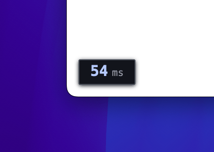
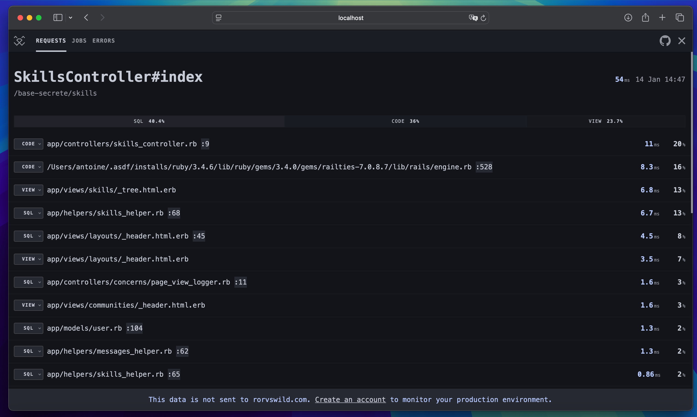
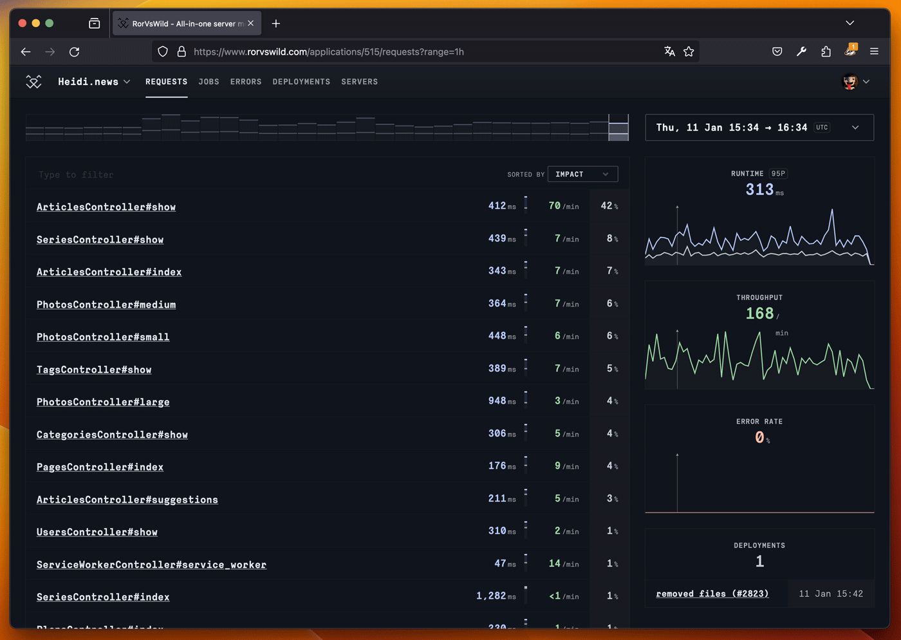

# RorVsWild

*RoRvsWild* is a ruby gem to monitor performances and exceptions in Ruby on Rails applications.

This gem has a double mode, **development** and **production**.  
It can be used without an account to monitor your requests performances in your development environment.  
It can also be used in your production and staging environments with an account on https://rorvswild.com. With such an account you also get extra benefits such as 30 day trace, background jobs monitoring, exceptions monitoring and notifications.

## Development mode

### Install the gem

* Add in your Gemfile `gem "rorvswild"`
* Run `bundle install` in you terminal
* Restart your local server and you’ll see a small button in the bottom left corner of your page.

Click on the button, or navigate to http://localhost:3000/rorvswild to see the details panel:

## Production mode

**To monitor your production or staging environment, you need an API key.**
Signup on https://www.rorvswild.com and create an app to get one.

* Add in your Gemfile `gem "rorvswild"`
* Run `bundle install` in you terminal
* Run `rorvswild-install API_KEY` in you terminal
* Deploy/Restart your app
* Make a few requests and refresh your app page on rorvswild.com to view the dashboard.

## Full documentation

- [Installation](https://www.rorvswild.com/docs/get-started/installation)
- [Configuration](https://www.rorvswild.com/docs/get-started/configuration)

